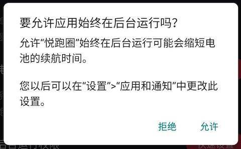

# Android 后台运行白名单，优雅实现保活

转自 [https://juejin.im/post/6844904023955341319](https://juejin.im/post/6844904023955341319)

首先，在 AndroidManifest.xml 文件中配置一下权限：

```
<uses-permission android:name="android.permission.REQUEST_IGNORE_BATTERY_OPTIMIZATIONS" />
```

可以通过以下方法，判断我们的应用是否在白名单中：

```
@RequiresApi(api = Build.VERSION_CODES.M)
private boolean isIgnoringBatteryOptimizations() {
    boolean isIgnoring = false;
    PowerManager powerManager = (PowerManager) getSystemService(Context.POWER_SERVICE);
    if (powerManager != null) {
        isIgnoring = powerManager.isIgnoringBatteryOptimizations(getPackageName());
    }
    return isIgnoring;
}
```

如果不在白名单中，可以通过以下代码申请加入白名单：

```
@RequiresApi(api = Build.VERSION_CODES.M)
public void requestIgnoreBatteryOptimizations() {
    try {
        Intent intent = new Intent(Settings.ACTION_REQUEST_IGNORE_BATTERY_OPTIMIZATIONS);
        intent.setData(Uri.parse("package:" + getPackageName()));
        startActivity(intent);
    } catch (Exception e) {
        e.printStackTrace();
    }
}
```

申请时，应用上会出现这样一个窗口：



## 厂商后台管理

Android 开发的一个难点在于，各大手机厂商对原生系统进行了不同的定制，导致我们需要进行不同的适配，后台管理就是一个很好的体现。几乎各个厂商都有自己的后台管理，就算应用加入了后台运行白名单，仍然可能会被厂商自己的后台管理干掉。

如果能把应用加入厂商系统的后台管理白名单，可以进一步降低进程被杀的概率。不同的厂商在不同的地方进行设置，一般是在各自的「手机管家」，但更难的是，就算同一个厂商的系统，不同的版本也可能是在不同地方设置。

最理想的做法是，我们根据不同手机，甚至是不同的系统版本，给用户呈现一个图文操作步骤，并且提供一个按钮，直接跳转到指定页面进行设置。但需要对每个厂商每个版本进行适配，工作量是比较大的。我使用真机测试了大部分主流 Android 厂商的手机后，整理出了部分手机的相关资料。

首先我们可以定义这样两个方法：\


```
/**
 * 跳转到指定应用的首页
 */
private void showActivity(@NonNull String packageName) {
    Intent intent = getPackageManager().getLaunchIntentForPackage(packageName);
    startActivity(intent);
}

/**
 * 跳转到指定应用的指定页面
 */
private void showActivity(@NonNull String packageName, @NonNull String activityDir) {
    Intent intent = new Intent();
    intent.setComponent(new ComponentName(packageName, activityDir));
    intent.addFlags(Intent.FLAG_ACTIVITY_NEW_TASK);
    startActivity(intent);
}
```

以下是部分手机的厂商判断，跳转方法及对应设置步骤，跳转方法不保证在所有版本上都能成功跳转，都需要加 try catch。

### 华为

厂商判断：

```
public boolean isHuawei() {
    if (Build.BRAND == null) {
        return false;
    } else {
        return Build.BRAND.toLowerCase().equals("huawei") || Build.BRAND.toLowerCase().equals("honor");
    }
}
```

跳转华为手机管家的启动管理页：

```
private void goHuaweiSetting() {
    try {
        showActivity("com.huawei.systemmanager",
            "com.huawei.systemmanager.startupmgr.ui.StartupNormalAppListActivity");
    } catch (Exception e) {
        showActivity("com.huawei.systemmanager",
            "com.huawei.systemmanager.optimize.bootstart.BootStartActivity");
    }
}
```

操作步骤：应用启动管理 -> 关闭应用开关 -> 打开允许自启动

### 小米

厂商判断：

```
public static boolean isXiaomi() {
    return Build.BRAND != null && Build.BRAND.toLowerCase().equals("xiaomi");
}
```

跳转小米安全中心的自启动管理页面：

```
private void goXiaomiSetting() {
    showActivity("com.miui.securitycenter",
        "com.miui.permcenter.autostart.AutoStartManagementActivity");
}
```

操作步骤：授权管理 -> 自启动管理 -> 允许应用自启动

### OPPO

厂商判断：

```
public static boolean isOPPO() {
    return Build.BRAND != null && Build.BRAND.toLowerCase().equals("oppo");
}
复制代码
```

跳转 OPPO 手机管家：

```
private void goOPPOSetting() {
    try {
        showActivity("com.coloros.phonemanager");
    } catch (Exception e1) {
        try {
            showActivity("com.oppo.safe");
        } catch (Exception e2) {
            try {
                showActivity("com.coloros.oppoguardelf");
            } catch (Exception e3) {
                showActivity("com.coloros.safecenter");
            }
        }
    }
}
```

操作步骤：权限隐私 -> 自启动管理 -> 允许应用自启动

### VIVO

厂商判断：

```
public static boolean isVIVO() {
    return Build.BRAND != null && Build.BRAND.toLowerCase().equals("vivo");
}
```

跳转 VIVO 手机管家：

```
private void goVIVOSetting() {
    showActivity("com.iqoo.secure");
}
```

操作步骤：权限管理 -> 自启动 -> 允许应用自启动

### 魅族

厂商判断：

```
public static boolean isMeizu() {
    return Build.BRAND != null && Build.BRAND.toLowerCase().equals("meizu");
}
```

跳转魅族手机管家：

```
private void goMeizuSetting() {
    showActivity("com.meizu.safe");
}
```

操作步骤：权限管理 -> 后台管理 -> 点击应用 -> 允许后台运行

### 三星

厂商判断：

```
public static boolean isSamsung() {
    return Build.BRAND != null && Build.BRAND.toLowerCase().equals("samsung");
}
复制代码
```

跳转三星智能管理器：

```
private void goSamsungSetting() {
    try {
        showActivity("com.samsung.android.sm_cn");
    } catch (Exception e) {
        showActivity("com.samsung.android.sm");
    }
}
```

操作步骤：自动运行应用程序 -> 打开应用开关 -> 电池管理 -> 未监视的应用程序 -> 添加应用

### 乐视

厂商判断：

```
public static boolean isLeTV() {
    return Build.BRAND != null && Build.BRAND.toLowerCase().equals("letv");
}
```

跳转乐视手机管家：

```
private void goLetvSetting() {
    showActivity("com.letv.android.letvsafe", 
        "com.letv.android.letvsafe.AutobootManageActivity");
}
```

操作步骤：自启动管理 -> 允许应用自启动

### 锤子

厂商判断：

```
public static boolean isSmartisan() {
    return Build.BRAND != null && Build.BRAND.toLowerCase().equals("smartisan");
}
```

跳转手机管理：

```
private void goSmartisanSetting() {
    showActivity("com.smartisanos.security");
}
```

操作步骤：权限管理 -> 自启动权限管理 -> 点击应用 -> 允许被系统启动
