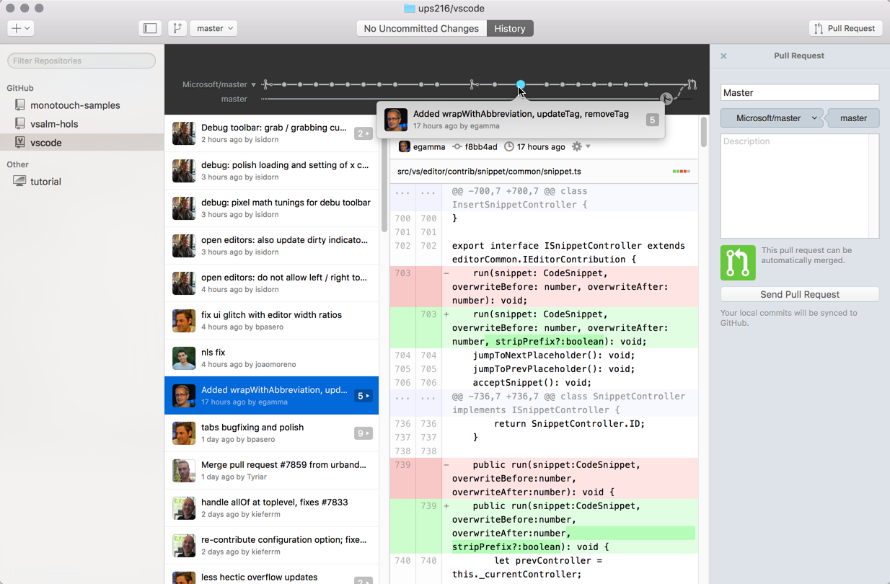
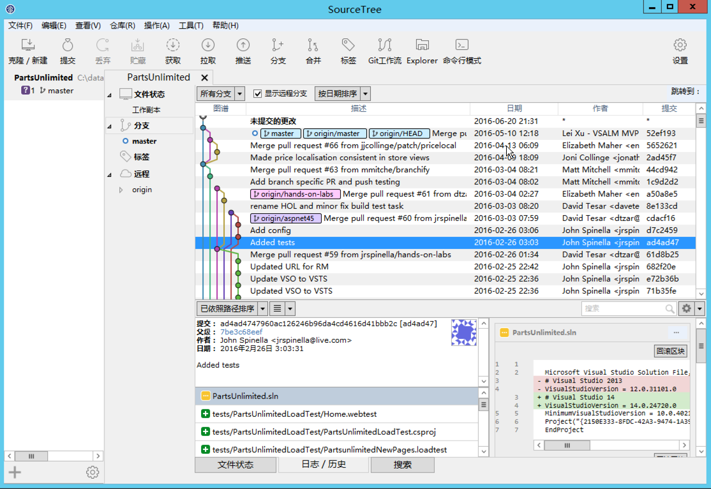
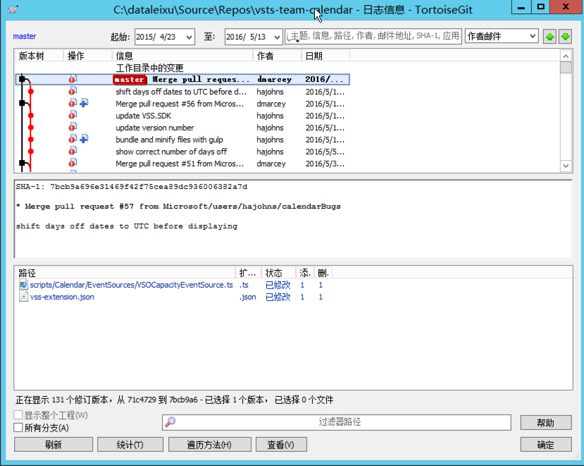

# GUI Software

**GitHub for Desktop**

全球开发人员交友俱乐部提供的强大工具，功能完善，使用方便。对于使用GitHub的开发人员来说是非常便捷的工具。界面干净，用起来非常顺手，上面的这条timeline非常漂亮，也可以直接提交PR。

唯一让我失望的是GitHub for Desktop不带三方合并工具，你必须自己手动解决冲突才可以。

– 免费  
– 同时支持 Windows 和 Mac：对于需要经常在不同的操作系统间切换的开发人员来说非常方便。  
– 漂亮的界面：作为每天盯着看的工具，颜值是非常重要的  
– 支持Pull Request：直接从客户端提交PR，很方便  
– Timeline 支持：直接在时间线上显示每次提交的时间点和大小  
– 支持git LFS：存储大文件更加节省空间和高效  
– 不支持三方合并：需要借助第三方工具才行

**Source Tree**

SourceTree是老牌的Git GUI管理工具了，也号称是最好用的Git GUI工具。我的体验是确实强大，功能丰富，基本操作和高级操作都设计得非常流畅，适合初学者上手。

这个工具很有特色的一个功能就是支持Git Flow，你可以一键创建Git Flow的工作流。Git Flow是非常高效的团队协作模型和流程，Git的一大特色就是灵活轻量的分支，但如何在自己的团队中用好这个功能来匹配自己的研发流程是个问题。内置Git Flow让那些不太熟悉的开发人员也可以很快上手，并且将研发的业务流程固化在工具中，可以说是非常贴心的设计。

在 Windows 环境下，SourceTree是多语言的，但是不知道为什么我的Mac版总是显示英文。

– 免费  
– 功能强大：无论你是新手还是重度用户，SourceTree 都会让你觉得很顺手。对于非常重度用户，Source Tree还支持自定义脚本的执行。  
– 同时支持 Windows 和 Mac 操作系统  
– 同时支持 Git 和 Mercurial 两种 VCS  
– 内置GitHub, BitBucket 和 Stash 的支持：直接绑定帐号即可操作远程repo

**TortoiseGit**

对这只小乌龟估计没有开发人员会不认识，SVN的超广泛使用也使得这个超好用的Svn客户端成了几乎每个开发人员的桌面必备软件。小乌龟只提供Windows版本，提供中文版支持的，对于中国的开发者来说者绝对是福音。

小乌龟的文件管理器右键菜单的操作方式对于新手来说非常的容易上手，而且容易理解。

– 免费  
– 只支持Windows操作系统：与文件管理器的良好集成  
– 中文界面  
– 与TortoiseSVN一脉相承的操作体验

