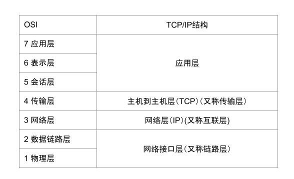

# Network

#### 

#### OSI七层网络模型\(从下往上\)：

**第1层 物理层**

物理层（Physical Layer）在局部局域网上传送数据帧（data frame），它负责管理计算机通信设备和网络媒体之间的互通。包括了针脚、电压、线缆规范、集线器、中继器、网卡、主机接口卡等。

**第2层 数据链路层**

数据链路层（Data Link Layer）负责网络寻址、错误侦测和改错。当表头和表尾被加至数据包时，会形成帧。数据链表头（DLH）是包含了物理地址和错误侦测及改错的方法。数据链表尾（DLT）是一串指示数据包末端的字符串。例如以太网、无线局域网（Wi-Fi）和通用分组无线服务（GPRS）等。

分为两个子层：逻辑链路控制（logical link control，LLC）子层和介质访问控制（media access control，MAC）子层。

**第3层 网络层**

 网络层（Network Layer）决定数据的路径选择和转寄，将网络表头（NH）加至数据包，以形成分组。网络表头包含了网络数据。例如:互联网协议（IP）等。

**第4层 传输层**

传输层（Transport Layer）把传输表头（TH）加至数据以形成数据报。传输表头包含了所使用的协议等发送信息。例如:传输控制协议（TCP）等。

**第5层 会话层**

会话层（Session Layer）负责在数据传输中设置和维护计算机网络中两台计算机之间的通信连接。

**第6层 表达层**

 表达层（Presentation Layer）把数据转换为能与接收者的系统格式兼容并适合传输的格式。

**第7层 应用层**

应用层（Application Layer）提供为应用软件而设的接口，以设置与另一应用软件之间的通信。例如: HTTP，HTTPS，FTP，TELNET，SSH，SMTP，POP3.HTML.等。

